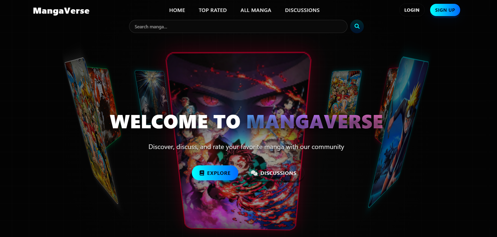

# MangaVerse

[](https://opensource.org/licenses/ISC)
[](https://nodejs.org/)
[](https://expressjs.com/)
[](https://www.mongodb.com/)

**Live Deployment:** [https://mangaverse-1-vrri.onrender.com/]

## Project Overview

MangaVerse is a full-stack web application designed for anime and manga enthusiasts. The platform serves as a comprehensive hub where users can access detailed information about manga titles, participate in community ratings, and engage in live discussions through dedicated threads. The application aims to foster a collaborative environment for content consumption and critique.


*Figure 1: Application Dashboard*


## Key Features

* **Manga Information Catalog:** Detailed views for various manga titles, including synopses and metadata.
* **User Rating System:** Interactive feature allowing authenticated users to rate and review specific titles.
* **Discussion Forums:** Live discussion threads enabling real-time community interaction and debate regarding favorite series.
* **User Authentication:** Secure registration and login functionality using encryption standards.
* **Responsive Design:** Optimized for viewing on various device sizes.

## Technical Architecture

This project utilizes a Model-View-Controller (MVC) architectural pattern.

### Tech Stack

* **Runtime Environment:** Node.js
* **Framework:** Express.js
* **Database:** MongoDB (via Mongoose ODM)
* **Templating Engine:** EJS (Embedded JavaScript)
* **Authentication:** bcryptjs (Hashing), express-session (Session management)
* **Styling:** CSS (served via Static files)
* **Deployment:** Render

### Project Structure

```text
Mangaverse/
├── config/              # Configuration files (Database connection, Seeding)
├── middleware/          # Custom middleware (Authentication checks)
├── models/              # Mongoose database schemas
├── public/              # Static assets (CSS, Client-side JS, Images)
├── routes/              # Express route definitions
├── views/               # EJS template files
├── .env                 # Environment variables (Gitignored)
├── app.js               # Application entry point
├── render.yaml          # Render deployment configuration
└── package.json         # Project dependencies and scripts

```

## Installation & Setup

Follow these steps to set up the project locally.

### Prerequisites

* Node.js (v14 or higher)
* npm (Node Package Manager)
* MongoDB Atlas URI or local MongoDB instance

### Step 1: Clone the Repository

```bash
git clone [https://github.com/your-username/mangaverse.git](https://github.com/your-username/mangaverse.git)
cd mangaverse

```

### Step 2: Install Dependencies

```bash
npm install

```

### Step 3: Environment Configuration

Create a `.env` file in the root directory. You must define the following variables for the application to function correctly:

```env
PORT=3000
MONGO_URI=your_mongodb_connection_string
SESSION_SECRET=your_secret_key

```

### Step 4: Database Seeding (Optional)

To populate the database with initial testing data, run the provided seed script:

```bash
npm run seed

```

### Step 5: Start the Application

**For Development (with Nodemon):**

```bash
npm run dev

```

**For Production:**

```bash
npm start

```

The server will initialize on `http://localhost:3000`.

## Deployment

This application is configured for deployment on Render using the included `render.yaml` specification.

1. Connect your GitHub repository to Render.
2. Render will automatically detect the `render.yaml` file.
3. Ensure environment variables (`MONGO_URI`, `SESSION_SECRET`) are added to the Render dashboard under "Environment".
